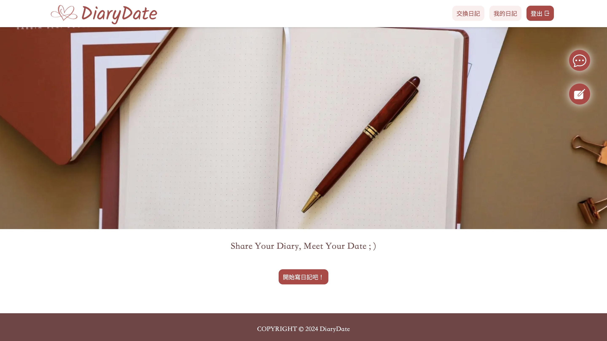
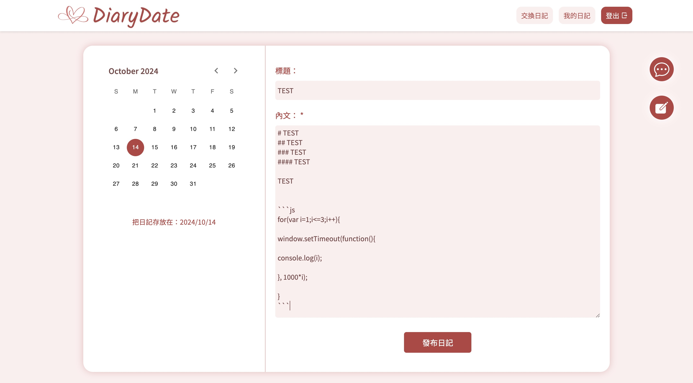
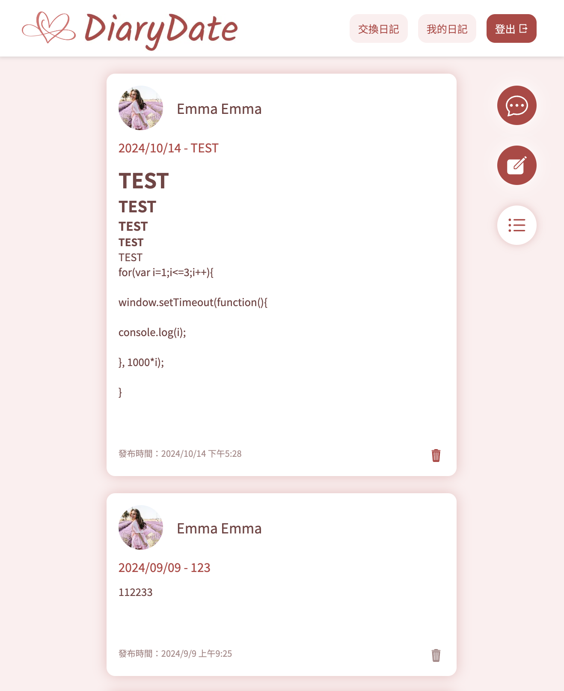
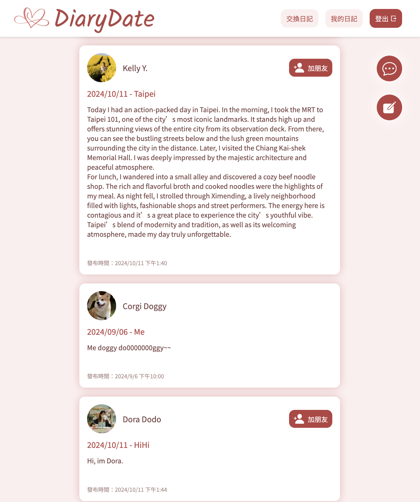
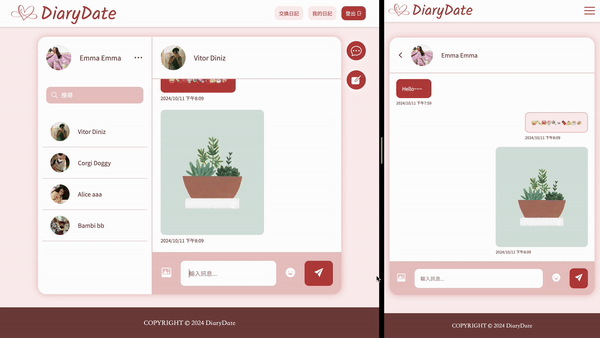
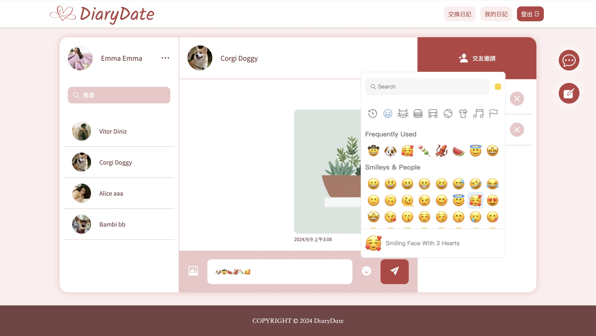

# [DiaryDate | 寫自己・交換日記](https://diary-date.vercel.app/)

DiaryDate 是兼具交友與聊天功能的寫日記平台，使用者可以在將文字記錄在日曆中，並與好友進行即時聊天。

## 發布日記功能

- 先在日曆中選擇想要存放日記的日子，再做內文編輯。

- 內文支援 Markdown 語法，編寫過程更有彈性。

- 發布日記後會直接進入“我的日記”頁面，在這裡可以看到所有發布過的日記，也可以刪除日記。

- 進入“交換日記”頁面可以看到其他使用者最新發布的日記，您最新發布的日記也會出現在別人的“交換日記”頁面中。

## 日記收藏功能

## 交友功能

## 即時聊天功能

