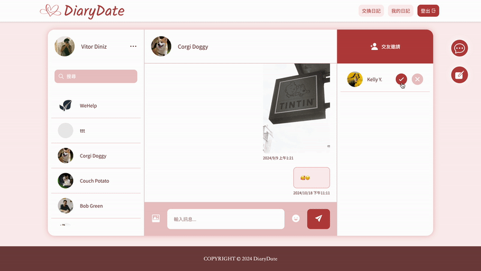

# [DiaryDate | 寫自己・交換日記](https://diary-date.vercel.app/)

DiaryDate 是兼具交友與聊天功能的寫日記平台，使用者可以將文字記錄在日曆中，並與好友進行即時聊天。

## 目錄

- [發布日記功能](#發布日記功能)
- [日記收藏功能](#日記收藏功能)
- [交友功能](#交友功能)
- [即時聊天功能](#即時聊天功能)

## 發布日記功能

- 先在日曆中選擇想要存放日記的日子，再做內文編輯。

- 內文支援 Markdown 語法，編寫過程更有彈性。

- 發布日記後會直接進入 “我的日記” 頁面，在這裡可以看到所有發布過的日記。

- 點選右下角小垃圾桶可以刪除日記。

- 進入 “交換日記” 頁面可以看到其他使用者最新發布的日記。

- 您最新發布的日記也會出現在其他使用者的 “交換日記” 頁面中。

## 日記收藏功能

- 進入“我的日記”，點選切換版面配置的白色按鈕，會進入日曆版的畫面。

- 在日曆版的畫面中，使用者寫過的日記會依照選擇的日期妥善收藏日曆中。

## 交友功能

- 進入 “交換日記” 頁面可以對想認識的人發送交友邀請。

- 尚未發布任何日記的使用者不會出現在 “交換日記” 頁面中。

- 成功發送交友邀請後，對方的聊天室交友邀請欄位會出現您的名字。

- 對方點選 “✔️”，你們就會分別出現在對方的聊天列表中，“交換日記” 頁面不會再出現加好友的按鈕。

- 對方點選 “✘”，您的邀請就會被移除，您仍可以在 “交換日記” 頁面重新發送交友邀請。

## 即時聊天功能

- 聊天紀錄自動捲動到最底層，提升使用者體驗。

- 使用 Firestore 的 onSnapShot 自動接收資料更新，實現即時聊天。

- 每則訊息配有 UUID，預留未來訊息管理的優化空間。

- 插入 Emoji Picker 增強聊天互動感。

- 點擊任意位置關閉 Emoji Picker。

